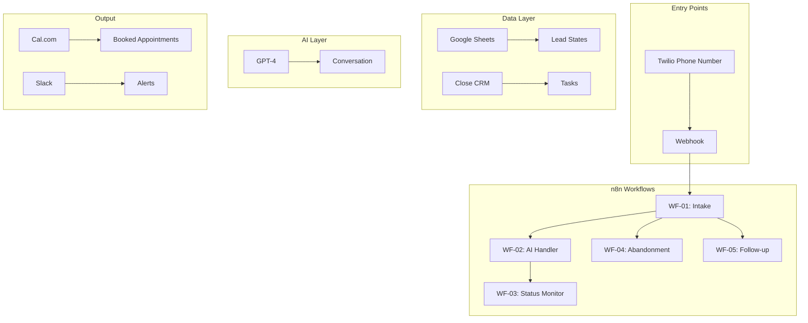
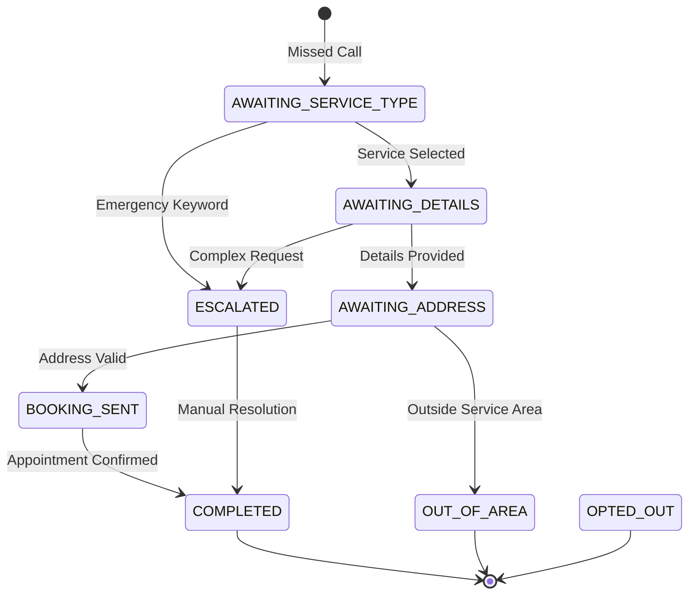

# CallLock n8n Automation PRD - MVP v1.0
Version: 1.0.0
Status: APPROVED FOR DEVELOPMENT
Last Updated: January 2024
Author: Rashid (Founder)

---

## 📋 Executive Summary

CallLock MVP v1.0 is a Done-For-You automation platform that captures missed calls for trades/service businesses and converts them into booked appointments using AI-powered SMS conversations. The system requires zero technical work from clients and deploys in 48 hours.

**Target Launch:** February 2024
**Target Clients:** 10 pilot customers
**Success Metric:** 30% of missed calls → booked jobs

---

## 🎯 Problem Statement

### Customer Problem
Service businesses ($500k-$5M revenue) lose 20-31% of potential revenue from missed calls. When owners/crews are on job sites, incoming calls go to voicemail. By the time they call back, 85% of leads have already booked with competitors.

### Current Solutions Fall Short
1. **Human answering services:** Slow, expensive ($500-2000/mo), error-prone
2. **DIY automation tools:** Complex setup, requires technical expertise, 40+ hours to configure
3. **Marketing agencies:** Bundle unnecessary services, $3000-10,000/mo, slow implementation

### Market Validation
- TAM: 1.9M businesses in target revenue range
- Average loss: $10,000-15,000/month in missed revenue
- Willingness to pay: $500-1,500/mo for Done-For-You solution

---

## 💡 Solution Overview

### Core Value Proposition
"We turn your missed calls into booked jobs automatically. Our team sets everything up in 48 hours. You just show up to the appointments."

### How It Works
1. **Missed call detected** → Twilio webhook triggers
2. **Instant SMS sent** → Within 5 seconds
3. **AI qualifies lead** → GPT-4 conversation
4. **Appointment booked** → Direct to calendar
5. **Follow-up automated** → Reminders and re-engagement

### Key Differentiators
- **100% Done-For-You:** We handle all setup and maintenance
- **48-hour deployment:** Fastest in market
- **Industry-specific:** Built for trades, not generic
- **No software to learn:** Zero client training needed

---

## 👤 User Personas

### Primary: Owner-Operator "Mike"
- **Business:** Mike's Plumbing LLC
- **Revenue:** $800K/year
- **Team:** Mike + 2 technicians
- **Pain:** Misses 30+ calls/week while on jobs
- **Tech skill:** Low - uses smartphone and basic software
- **Goal:** Capture every lead without hiring receptionist

### Secondary: Growth-Stage Owner "Sarah"
- **Business:** Premium HVAC Services
- **Revenue:** $3M/year
- **Team:** 8 technicians, 1 office manager
- **Pain:** After-hours and overflow calls lost
- **Tech skill:** Medium - uses CRM and scheduling software
- **Goal:** Scale without adding overhead

---

## 📖 User Stories

### Critical Path (P0 - Must Have)

| ID | Story | Acceptance Criteria |
|----|-------|-------------------|
| US-001 | As Mike, when I miss a call, I want the caller to receive an instant text so they don't call my competitor | SMS sent within 5 seconds of missed call |
| US-002 | As Mike, I want the AI to find out what service they need so I know if it's worth calling back | AI captures service type and urgency level |
| US-003 | As Mike, I want qualified jobs booked directly on my calendar so I don't have to manage scheduling | Appointments appear in Google Calendar with all details |
| US-004 | As Sarah, I want landline callers identified so my team can call them back | Landline numbers flagged and task created in CRM |
| US-005 | As Sarah, I want after-hours calls handled differently so customers know we're closed but monitoring emergencies | Time-based routing with appropriate messaging |

### Important (P1 - Should Have)

| ID | Story | Acceptance Criteria |
|----|-------|-------------------|
| US-006 | As Mike, I want customers who don't respond to get follow-up messages so we don't lose them | Re-engagement after 2 hours, final attempt after 24 hours |
| US-007 | As Sarah, I want to see all captured leads in one dashboard so I can track ROI | Google Sheets dashboard with lead status and conversion metrics |
| US-008 | As Mike, I want duplicate calls prevented so customers don't get multiple texts | CallSid tracking prevents duplicate processing |

### Nice to Have (P2 - Could Have)

| ID | Story | Acceptance Criteria |
|----|-------|-------------------|
| US-009 | As Sarah, I want Spanish language support for Hispanic customers | AI detects Spanish and responds appropriately |
| US-010 | As Mike, I want review requests sent after job completion | Automated review request 24 hours post-service |

---

## 🔧 Technical Requirements

### System Architecture


### Workflow Specifications

#### WF-01: Missed Call Intake
**Trigger:** Twilio webhook (POST /webhook/missed-call)
**SLA:** < 5 seconds to SMS send
**Nodes:**
1. Extract & validate phone number
2. Check for duplicates (CallSid)
3. Carrier lookup (landline detection)
4. Create lead record in Sheets
5. Check business hours
6. Send initial SMS (mobile) OR create callback task (landline)
7. Log to CRM

**Error Handling:**
- Twilio API failure → Retry 3x exponential backoff
- Invalid phone → Log and skip
- Duplicate → Return 200 OK, no processing

#### WF-02: SMS Conversation Handler
**Trigger:** Twilio SMS webhook (POST /webhook/sms-reply)
**SLA:** < 10 seconds response
**Nodes:**
1. Load lead state from Sheets
2. Check for opt-out keywords
3. GPT-4 intent analysis
4. State machine transition
5. Data validation (address, service type)
6. Calendar availability check
7. Send response SMS
8. Update state
9. Log to CRM

**GPT-4 Prompt:**
```
You are an AI assistant for {{business_name}}.
Current state: {{current_state}}
Message history: {{history}}

Determine:
1. Intent (emergency/routine/estimate)
2. Next state
3. Response (max 160 chars)
4. Required data still needed

If ready to book, extract service type, urgency, preferred time.
```

#### WF-03: Status Handler
**Trigger:** Twilio status callback
**Purpose:** Handle SMS delivery failures
**Actions:**
- If undelivered → Create urgent callback task
- If failed (landline) → Flag for manual calling
- Log all status changes

#### WF-04: Abandonment Recovery
**Trigger:** Cron (hourly)
**Purpose:** Re-engage silent leads
**Logic:**
- Query: leads inactive > 2 hours, not completed
- Send friendly nudge via GPT-4
- Mark as reengagement_sent

#### WF-05: Second Follow-up
**Trigger:** Cron (every 6 hours)
**Purpose:** Final attempt
**Logic:**
- Query: reengagement_sent = true, > 24 hours old
- Send final message
- Create low-priority CRM task for manual follow-up

### Data Schema

#### Google Sheets: 'leads' table
```javascript
{
  lead_id: STRING (LEAD_timestamp_random),
  phone: STRING (E.164 format),
  state: ENUM [
    'AWAITING_SERVICE_TYPE',
    'AWAITING_DETAILS',
    'AWAITING_ADDRESS',
    'BOOKING_SENT',
    'COMPLETED',
    'ESCALATED',
    'OPTED_OUT',
    'OUT_OF_AREA'
  ],
  message_count: INTEGER,
  service_type: STRING,
  urgency: ENUM ['emergency', 'routine', 'estimate'],
  address: STRING,
  preferred_time: STRING,
  last_message_time: TIMESTAMP,
  is_landline: BOOLEAN,
  opted_out: BOOLEAN,
  reengagement_sent: BOOLEAN,
  second_followup_sent: BOOLEAN,
  created_at: TIMESTAMP,
  booking_time: TIMESTAMP,
  completion_status: STRING
}
```

### Integration Requirements

| Service | Purpose | Required Credentials |
|---------|---------|---------------------|
| Twilio | SMS/Voice | Account SID, Auth Token, Phone Number |
| OpenAI | GPT-4 conversations | API Key |
| Google Sheets | Lead database | OAuth2 credentials |
| Google Calendar | Check availability | Calendar ID, OAuth2 |
| Cal.com | Booking links | API Key |
| Close.io | CRM tasks | API Key |
| Slack | Alerts | Webhook URL |

---

## 📊 Success Metrics

### Primary KPIs (Must Track)
- **Capture Rate:** 95%+ of missed calls get SMS (excluding landlines)
- **Response Time:** < 5 seconds to first SMS
- **Conversation Rate:** 30%+ leads complete intake
- **Booking Rate:** 20%+ leads book appointment
- **Revenue Recovery:** $5,000+ per client per month

### Secondary KPIs (Should Track)
- **Message Count:** Average 3-5 messages to booking
- **Abandonment Rate:** < 40% drop without completing
- **Re-engagement Success:** 20%+ respond to follow-up
- **Landline Percentage:** Track for callback efficiency
- **System Uptime:** 99.9% availability

### Client Success Metrics
- **Time to First Booking:** < 24 hours from go-live
- **ROI:** 3x+ monthly fee in recovered revenue
- **Setup Time:** < 48 hours from signup to live
- **Support Tickets:** < 2 per client per month

---

## 🚫 Out of Scope for MVP

| Feature | Reason | Target Version |
|---------|--------|----------------|
| Voice AI | Focus on SMS first | v2.0 |
| Multi-location | Single location only | v2.0 |
| Custom AI training | Use GPT-4 prompts | v3.0 |
| Email integration | SMS only for MVP | v2.0 |
| Multi-language | English only | v1.5 |
| Payment processing | Booking only | v2.0 |
| Two-way calendar sync | Read-only availability | v1.5 |
| Mobile app | Web dashboard only | v3.0 |

---

## 🏃 Implementation Timeline

### Day 1: Foundation
- [ ] Set up n8n instance
- [ ] Configure Twilio account and phone
- [ ] Create Google Sheets structure
- [ ] Build WF-01 (Intake)
- [ ] Test with real phones

### Day 2: Intelligence
- [ ] Integrate GPT-4
- [ ] Build WF-02 (AI Handler)
- [ ] Implement state machine
- [ ] Test conversation flows
- [ ] Add Cal.com integration

### Day 3: Reliability
- [ ] Build WF-03 (Status)
- [ ] Build WF-04 (Abandonment)
- [ ] Build WF-05 (Follow-up)
- [ ] Add error handling
- [ ] Implement monitoring

### Day 4: Production
- [ ] Load testing (100 concurrent)
- [ ] Security audit
- [ ] Create client onboarding SOP
- [ ] Deploy first pilot client
- [ ] Monitor and optimize

---

## ✅ MVP Acceptance Criteria

### Functional Requirements
- [ ] Missed calls trigger SMS within 5 seconds
- [ ] AI successfully qualifies 80%+ of responsive leads
- [ ] Appointments book to calendar without conflicts
- [ ] Landlines create callback tasks in CRM
- [ ] Business hours routing works correctly
- [ ] Follow-up sequences execute on schedule
- [ ] Duplicate calls don't create multiple texts
- [ ] Opt-out keywords stop all messaging

### Non-Functional Requirements
- [ ] System handles 100 concurrent conversations
- [ ] 99.9% uptime during business hours
- [ ] All workflows complete in < 30 seconds
- [ ] Error rate < 1%
- [ ] SMS delivery rate > 95%
- [ ] Data encrypted at rest
- [ ] TCPA compliance for SMS
- [ ] Graceful degradation if services unavailable

### Documentation Requirements
- [ ] Client onboarding guide
- [ ] Workflow documentation
- [ ] Troubleshooting runbook
- [ ] API credentials setup guide
- [ ] Performance tuning guide

---

## 🚀 Go-to-Market Requirements

### Launch Prerequisites
- [ ] 10 pilot clients identified
- [ ] Pricing validated ($499/mo + $1500 setup)
- [ ] Support process defined
- [ ] Monitoring dashboard live
- [ ] Backup and recovery tested
- [ ] Legal review complete (TCPA, privacy)

### Pilot Success Criteria
- 8/10 clients see positive ROI in month 1
- Average 5+ jobs booked per client per month
- NPS score > 50
- Zero critical failures
- < 48 hour setup achieved

---

## 📝 Appendix

### A. State Machine Diagram


### B. Sample Conversations

**Scenario 1: Emergency Plumbing**
```
System: "Hey there, thanks for calling Mike's Plumbing! Sorry we missed you. 
         What can we help you with today? Reply: 1-Emergency, 2-Routine, 3-Estimate"
Customer: "1"
System: "Got it - emergency service. What's happening?"
Customer: "Pipe burst in basement flooding"
System: "We'll get someone there ASAP! What's your service address?"
Customer: "123 Main St Springfield"
System: "Mike is on the way! He'll arrive within 60 minutes. 
         Reply CANCEL if plans change."
```

**Scenario 2: Routine HVAC**
```
System: "Hey there, thanks for calling Premium HVAC! Sorry we missed you. 
         What can we help with?"
Customer: "AC not cooling"
System: "We can help with that. Is this urgent or can we schedule for tomorrow?"
Customer: "Tomorrow is fine"
System: "Perfect! What's your address?"
Customer: "456 Oak Ave"
System: "Great! I have an opening tomorrow at 10am or 2pm. Which works better?"
Customer: "10am"
System: "Booked! Tech will arrive tomorrow 10am at 456 Oak Ave for AC service. 
         You'll get a reminder tonight."
```

### C. Error Response Templates
- **Invalid Input:** "I didn't understand that. Please reply with [valid options]"
- **Out of Area:** "Sorry, we don't service that area. We cover [service areas]"
- **No Availability:** "We're fully booked today. First available is [date]. Reply YES to book."
- **System Error:** "System temporarily unavailable. We'll call you within 30 minutes."

---

**Document Control:**
- Version: 1.0.0
- Status: APPROVED
- Owner: Rashid (Founder)
- Last Review: January 2024
- Next Review: Post-MVP Launch

**Approval:**
- Product: ✅ Rashid
- Engineering: ✅ [Dev Lead]
- Operations: ✅ [Ops Lead]